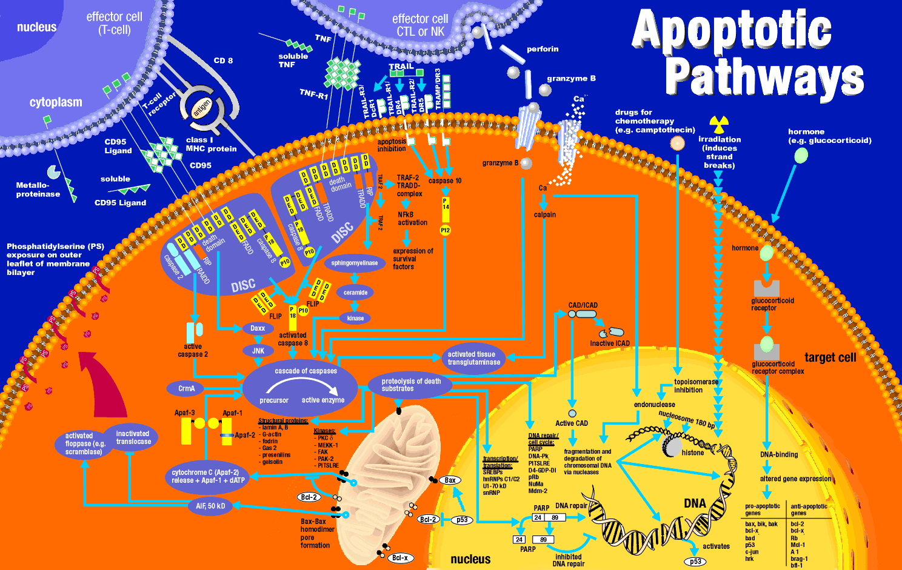

## Welcome To My Page

### Projects

1. [hello-world](https://github.com/Futurist4Science/hello-world) first practice project
2. [My Website](https://github.com/Futurist4Science/Futurist4Science.github.io) GitHub pages site
3. [Matlab Scripts](https://github.com/Futurist4Science/Matlab-shortcuts) useful scripts I needed
4. CurveAlign collagen fiber image analysis software (support/dev)
5. CT-FIRE collagen fiber image analysis software (support/dev)

#### Just For Fun

 
Thanks to [Vivek](http://biochem-vivek.tripod.com/id58.html) 

#### Contact Information

_work in progress..._

#### Badges

